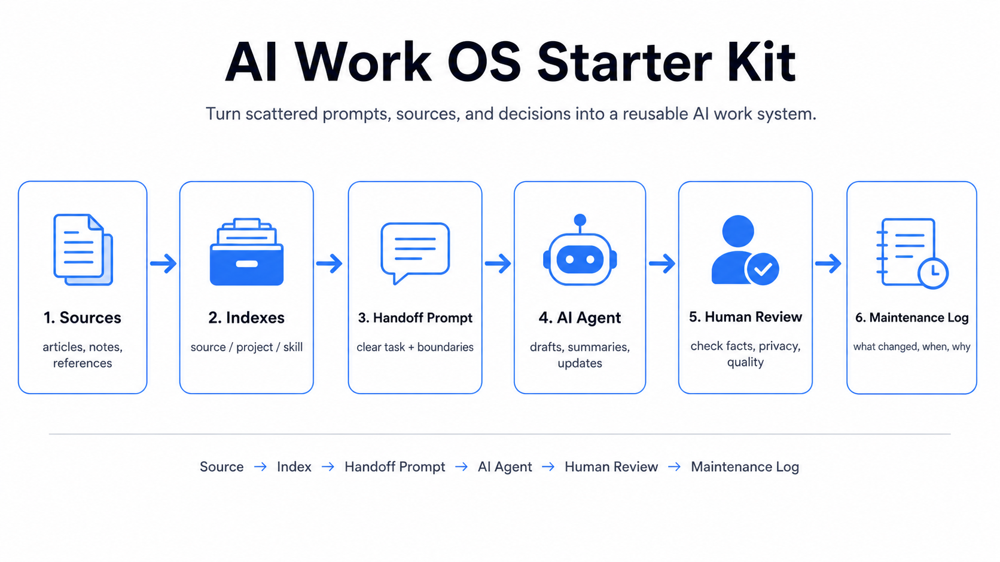

# AI Work OS Starter Kit

A lightweight starter kit for using AI agents such as ChatGPT, Codex, Claude, and Gemini as a long-term work operating system, not just one-off chat tools.

This repository gives you a simple structure for organizing context, sources, decisions, prompts, routines, and maintenance logs so AI agents can work with accumulated knowledge over time.

<p align="center">
  
</p>

<p align="center"><em>Source → Index → Handoff Prompt → AI Agent → Human Review → Maintenance Log</em></p>

## Problem This Solves

AI tools forget context. Teams lose decisions in scattered chats. Prompts become hard to reuse.

This starter kit gives AI work a simple operating layer: source indexes, project indexes, handoff prompts, review routines, and maintenance logs. The result is a small, practical system for keeping AI-assisted work easier to resume, review, and improve.

## What This Is / What This Is Not

This is:

- A lightweight Markdown-based operating structure
- A starter kit for AI-assisted work continuity
- Useful for PMs, analysts, operators, and non-engineers

This is not:

- An automation platform
- A private data vault
- A replacement for human review
- A full knowledge management product

## Use This When

- You use AI tools repeatedly but keep losing context between sessions
- You want a safer way to hand work to AI agents
- You need lightweight source, decision, and prompt tracking
- You want a Markdown-first system before building any app or database

## Who This Is For

- Product managers who coordinate research, launches, reports, and decisions
- Analysts who need repeatable evidence handling and report workflows
- Operators who want consistent daily and weekly AI-assisted routines
- Non-engineers who use AI tools but need a safer working system
- Small teams creating shared AI working habits without heavy infrastructure

## Core Idea

AI agents work better when the workspace around them is structured.

Instead of pasting scattered context into a chat window each time, this kit helps you maintain:

- Source indexes: what information exists and where it came from
- Project indexes: what work is active and what decisions were made
- Skill indexes: reusable prompts, workflows, and operating patterns
- Handoff prompts: clear instructions for an AI agent
- Maintenance logs: what changed, when, and why

The goal is practical continuity, not automation for its own sake.

## Repository Structure

```text
.
├─ README.md
├─ README.ko.md
├─ LICENSE
├─ .gitignore
├─ AGENTS.md
├─ CONTRIBUTING.md
├─ assets/
│  └─ ai-work-os-flow.png
├─ 00_system/
│  ├─ command_router.md
│  ├─ model_tool_routing_policy.md
│  └─ update_rules.md
├─ 01_wiki/
│  ├─ source_index.md
│  ├─ project_index.md
│  └─ skill_index.md
├─ 02_routines/
│  ├─ daily_capture.md
│  ├─ weekly_rewiki.md
│  └─ maintenance_log.md
├─ 03_templates/
│  ├─ codex_handoff_template.md
│  ├─ evidence_card_template.md
│  ├─ report_brief_template.md
│  └─ project_decision_log_template.md
├─ 04_examples/
│  └─ sample_project/
└─ docs/
   ├─ examples.md
   ├─ getting_started.md
   ├─ safety_and_privacy.md
   └─ philosophy.md
```

## Quick Start in 10 Minutes

1. Read `docs/safety_and_privacy.md`.
2. Pick one fictional or non-sensitive project to practice with.
3. Add a row to `01_wiki/project_index.md`.
4. Add source references to `01_wiki/source_index.md`.
5. Copy `03_templates/codex_handoff_template.md` into your AI chat or coding agent.
6. Ask the agent to perform one narrow task.
7. Review the output manually.
8. Record the result in `02_routines/maintenance_log.md`.

## Recommended Workflow

1. Capture source
2. Update index
3. Write handoff prompt
4. Run AI agent
5. Review output
6. Update maintenance log

This creates a repeatable loop: context becomes easier to reuse, and AI output becomes easier to audit.

## Safety and Privacy Warning

Do not commit private or sensitive information to this repository.

Never include credentials, API keys, OAuth tokens, company data, personal data, contracts, unreleased business plans, private metrics, internal file paths, or confidential logs. Use fictional examples or public information only.

See `docs/safety_and_privacy.md` before adapting this kit for real work.

## Example Use Cases

- Weekly market scan using public sources
- Fictional product launch report
- Personal research knowledge base
- AI-assisted meeting summary workflow using non-sensitive notes
- Public documentation maintenance
- Reusable prompt and review checklist library

See [docs/examples.md](docs/examples.md) for short copy-paste friendly examples.

## Contributing

Contributions are welcome when they keep the starter kit public-safe, concise, and easy to adapt. Start with [CONTRIBUTING.md](CONTRIBUTING.md).

## Roadmap

- Add optional templates for review workflows
- Add lightweight issue and decision tracking patterns
- Add examples for multi-agent review flows
- Add non-engineer onboarding guide

## Korean README

Korean users can start with `README.ko.md`.

## License

MIT License. See `LICENSE`.
